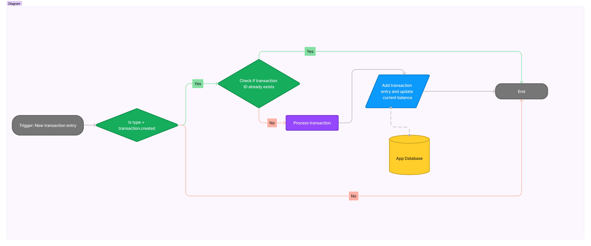

## Monzo_obs

I decided to create an overlay for my streams to display my monzo bank balance in real time.
This includes the ability to show transactions as notifications in real time.

### Tech-stack
- Firebase cloud function
- Realtime databasing
- NodeJS

### considerations and implementation

Monzo provides developers the ability to develop applications that allow users to manage or integrate with their banks, In the case of my implemnations I decided to not use the api as using Auth2 within a hosted overlay would be too convuluted to do. So instead I decided that an effective solution was to use the available webhook available on the monzo developer portal to send transations to a created endpoint.

These webhook entries include information such as the data type and incase of transaction, the amount deposited/withdrawn from the account, aswell as description and time.
Example of transaction json:
```
{
	"type": "transaction.created",
	"data": {
		"account_id": "acc_00008gju41AHyfLUzBUk8A",
		"amount": -350,
		"created": "2015-09-04T14:28:40Z",
		"currency": "GBP",
		"description": "Ozone Coffee Roasters",
		"id": "tx_00008zjky19HyFLAzlUk7t",
		"category": "eating_out",
		"is_load": false,
		"settled": "2015-09-05T14:28:40Z",
		"merchant": {
			"address": {
				"address": "98 Southgate Road",
				"city": "London",
				"country": "GB",
				"latitude": 51.54151,
				"longitude": -0.08482400000002599,
				"postcode": "N1 3JD",
				"region": "Greater London"
			},
			"created": "2015-08-22T12:20:18Z",
			"group_id": "grp_00008zIcpbBOaAr7TTP3sv",
			"id": "merch_00008zIcpbAKe8shBxXUtl",
			"logo": "https://pbs.twimg.com/profile_images/527043602623389696/68_SgUWJ.jpeg",
			"emoji": "🍞",
			"name": "The De Beauvoir Deli Co.",
			"category": "eating_out"
		}
	}
}
```


For the endpoint firebase realtime databasing allows me to directly make data creation requests directly to the database using a restful endpoint without having to setup a backend saving development time.
So using firebase functions I would be able to create a trigger when a data entry is created, to update a number which would be used to keep track of the account balance, This balance will have to be intially inputted manually into the database.
One issue I had to take into consideration is when a transaction is made, 4 entries ar added to the database instead of just 1, So using a ID I can prevent the same transaction being processed multiple times.
